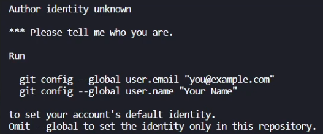

## Fundamentos de Git 💯

#### ¿Qué es Git?

Git es un software de control de versiones encargado de llevar un registro de todos los cambios realizados a tus archivos al crear un repositorio en la carpeta de tu archivo.

#### ¿Por qué utilizarlo?

Puedes conectar tu repositorio a un servidor remoto, por ejemplo GitHub y así puedes trabajar con muchas personas en el mismo proyecto. Si tu o alguien más se equivoca o daña el archivo, puedes regresar a una versión anterior de él.

#### Comandos

- `git clone <url repositorio>` : Clonar un repositorio remoto (GitHub) en tu espacio local.
- `git init`: inicializa nuestro repositorio
- `git add <archivo>`: Añade un archivo modificado al staging
- `git add .`: Añade todos los archivos modificados al staging
- `git commit -m "mensaje personalizado"`: Dejar una firma de lo que se subirá al repositorio remoto
- `git status`: Ver los estados de los archivos modificados (si se encuentran en el staging o no)
- `git rm --cached <archivo>` : Se utiliza para devolver el archivo que se tiene en RAM (stagging area).
- `git show`: Te muestra los cambios históricos de cualquier archivo que tenga cambios.
- `git log <archivo>`: Muestra la historia del archivo.
- `git push` : Enviar tus cambios locales al repositorio remoto (GitHub)
- `git pull` : Traer los cambios que están en el repositorio remoto (GitHub) al repositorio local.
- `git config --list` : Muestra la lista de configuración de git.

#### Deshacer cambios con git reset

- [Reset](./reset/reset.md)

#### Uso de Branch

- [Branch](./branch.md)

#### Uso de Merge

- [Merge](./merge.md)

#### Recomendaciones!

Recuerda que Git está optimizado para trabajar en equipo, por lo tanto, debemos darle un poco de información sobre nosotros. No debemos hacerlo todas las veces que ejecutamos un comando, basta con ejecutar solo una sola vez los siguientes comandos con tu información:

- `git config --global user.email "Tu correo"`
- `git config --global user.name "Tu nombre"`

Si por algún motivo te equivocaste en el nombre o email que configuraste al principio, lo puedes modificar de la siguiente manera:

- `git config --global --replace-all user.email "Tu correo"`
- `git config --global --replace-all user.name "Tu nombre"`

O si deseas eliminar y añadir un nuevo nombre:

- `git config --global --unset-all user.name "Nombre antiguo"`
- `git config --global --add user.name "Nuevo nombre"`

Para el email es:

- `git config --global --unset-all user.email "Email antiguo"`
- `git config --global --add user.email "Nuevo email"`

Esto se hace para evitar el siguiente error:

#### ¿Qué es el staging?

El staging es el lugar donde se guardan temporalmente los cambios, para luego ser llevados definitivamente al repositorio. El repositorio es el lugar donde se guardan todos los registros de los cambios realizados a los archivos.

#### Representación gráfica del ciclo básico de trabajo en Git

#### Conceptos importantes de Git

- `Bug`: Error en el código.
- `Repository`: Donde se almacena todo el proyecto, el cual puede vivir tanto en local como en remoto. El repositorio guarda un historial de versiones.
- `Fork`: Si en algún momento queremos contribuir al proyecto de otra persona, o si queremos utilizar el proyecto de otro como el punto de partida del nuestro. Esto se conoce como “fork”.
- `Clone`: Clonar un repositorio en tu espacio personal (local).
- `Branch`: Es una bifurcación del proyecto que se está realizando para anexar una nueva funcionalidad o corregir un bug.
- `Master`: Rama donde se almacena la última versión estable del proyecto que se está realizando.
- `Commit`: Consiste en subir cosas a la versión local del repositorio. De esta manera se puede trabajar en la rama de forma local sin tener que modificar ninguna versión en remoto ni tener la última versión remota, cosa muy útil en grandes desarrollos trabajados por varias personas.
- `Push`: Consiste en enviar todo lo que se ha confirmado con un commit al repositorio remoto. Aquí es donde se une nuestro trabajo con el de los demás.
- `Checkout`: Acción de descargarse una rama del repositorio GIT local (sí, Git tiene su propio repositorio en local para poder ir haciendo commits) o remoto.
- `Fetch`: Actualiza el repositorio local bajando datos del repositorio remoto al repositorio local sin actualizarlo, es decir, se guarda una copia del repositorio remoto en el local.
- `Merge`: La acción de merge es la continuación natural del fetch. El merge permite unir la copia del repositorio remoto con tu repositorio local, mezclando los diferentes códigos.
- `Pull`: Consiste en la unión del fetch y del merge, esto es, recoge la información del repositorio remoto y luego mezcla el trabajo en local con esta.
- `Diff`: Se utiliza para mostrar los cambios entre dos versiones del mismo archivo.