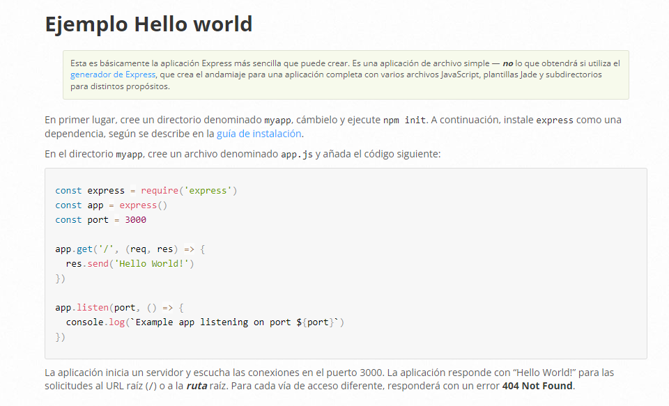
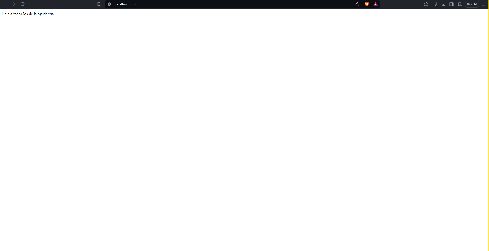

## Server con Express.js

Express.js es un framework utilizado con Node.js que facilita la creación de aplicaciones web y APIs. Proporciona una serie de características y funcionalidades que permiten construir aplicaciones de manera eficiente y rápida.

- Documentación oficial de Express.js: [**https://expressjs.com/**](https://expressjs.com/)

### Creación server básico con Express.js

Requisitos:

- Tener instalado **Visual Studio Code**.
- Tener instalada la versión actualizada de **Node.js 20.11.0 LTS.**
- Tener las ganas de aprender y programar! 🚀🚀🚀

### Pasos a seguir!

1. Abre la terminal de **Git Bash** o la de tu preferencia.

2. Crea un directorio para tu proyecto en el **escritorio** y navega a él:

```bash
mkdir ejemplo-express //Creamos un directorio
cd ejemplo-express //Navegamos al directorio que creamos
```

3. Creamos un archivo:

```bash
touch index.js // Creamos el archivo index.js
```

4. Abrimos el Visual Studio Code desde la terminal con el siguiente comando:

```bash
code . // Abrimos Visual Studio Code en el directorio ejemplo-express
```

5. Abrimos una terminal en Visual Studio Code con la combinación `Ctrl + J`.

6. Iniciamos nuestro proyecto:

```bash
npm init -y // Se utiliza la flag -y para iniciar un proyecto sin completar algunos parametros
```

7. Instalamos la dependencia, en este caso express:

```bash
npm i express
```

8. Una vez instalada la dependencia de express, nos vamos a la documentación oficial de [Express.js](https://expressjs.com/es/starter/hello-world.html).



9. Pasaremos este código a la versión mas usada en cuando a importar express, en este caso será la forma [nativa de imports](https://developer.mozilla.org/en-US/docs/Web/JavaScript/Guide/Modules).


10. Iniciamos el servidor en la terminal:

```bash
node index.js
```

11. El resultado de la terminal debería ser así:


12. Si clickeamos con `Ctrl + Click izquierda` del mouse  el `http://localhost:3000` se nos abre una pestaña y aparece lo siguiente:



13. Ya tenemos nuestro primer server con express! 🚀